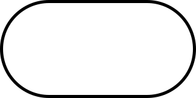
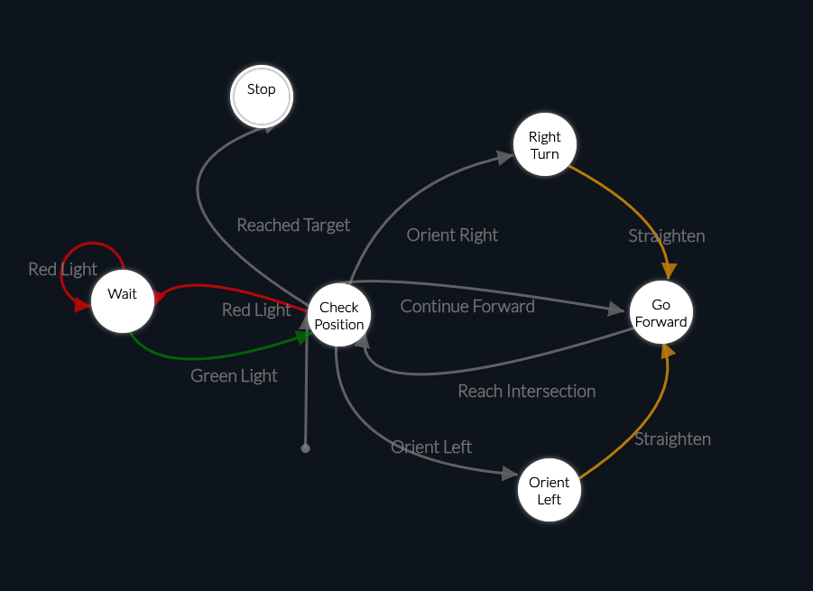

[comment]: # (THEME = black)
[comment]: # (CODE_THEME = base16/zenburn)

# Cooper CHESS CS: Day 1
August 2025     
Vaibhav Hariani

[comment]: # (!!!)

## Brief Intro

Welcome to Chess! 

I'm Vaibhav Hariani [vaibhav.hariani@cooper.edu], a senior EE. 
Throughout the lecture, please do not be afraid to ask any questions!

[comment]: # (!!!)
## Some basic objectives before we start:

[comment]: # (!!!)

- This crash course is designed for you to learn how to break down a CS problem, and approach it!

- For some of you, these may be too easy, and for others, it will be a lot. 
- Work with each other, and you'll all come out with something.
- Homework: I'm not grading anything, but it should help drill things home! 

Note: This is a college class, and it's not graded. I'm not here to make you learn anything, but I'm more than willing to help if you need it. 
[comment]: # (|||)
### What is a programming language? 

### Have you used any before?

### What are they good for?

[comment]: # (|||)
A programming language allows us, programmers/computer scientists, to define __ALGORITHMS__.

[comment]: # (!!!)
- Algorithms are sets of rules to be followed, allowing us(or machines) to complete tasks. 

- Before we get into programming (and CS), let's talk about some simple algorithms you've used. 

- Then, we'll learn some tools computer scientists use to define algorithms, like...           

[comment]: # (|||)
## Lesson 1.1: Flowcharts

Note:
WE DONT CARE ABOUT SPECIFICS!!!
For now, just describe whats going on, theres a problem posed, and its being solved.

[comment]: # (!!!)

Flowcharts let us take large, complex problems, and break them down into chunks.

Note: In the context of computer science, we can use these to think about how to implement our goals into code.

[comment]: # (!!!)

## Ok, how do I start making one of these?
Note:
- What are the inputs/entry states?
- Consider every factor involved that creates a fork, or splits decisions.
- From that, consider the steps involved to process your input into an output, 
from start to end.

[comment]: # (|||)

### Flowchart Operators: Terminal

(as according to ISO 5807.. your mileage may vary.....)

<!-- .element: style="height:20vh; image-rendering: crisp-edges;" -->

The Terminal represents the *start* or *end* of a flowchart, and is usually 
labeled as such, either explicitly or implicitly (eg. "receive signal")

[comment]: # (|||)

### Flowchart Operators: Process
<!-- .element: style="height:20vh; image-rendering: crisp-edges;" -->

The Process represents a (group of) operation(s) which *changes* our information 
in some way.

[comment]: # (|||)

### Flowchart Operators: Decision
<!-- .element: style="height:20vh; image-rendering: crisp-edges;" -->

The Decision operator changes our flow based on the *condition* set inside of 
the operator. 

[comment]: # (|||)

### Flowchart Operators: I/O
<!-- .element: style="height:20vh; image-rendering: crisp-edges;" -->

The I/O (in/out) operator represents either the input or output of information 
into our workflow.

Note:
The diagram we've shown INTENTIONALLY violates ISO5807: The start blocks and I/O are all different!
Standards are secondary to CLARITY. We can still understand the process! 

[comment]: # (!!!)

## Your turn:
Consider you're at home, and need to decide to go grocery shopping or not. 

What do you need in order to get that done? (eg, do i have time?) Can you do it? 
Make a flowchart to express that logical flow. Group up!

[comment]: # (!!!)
## Lesson 1.2: State Machines

[comment]: # (|||)
Flowcharts are useful, but it's very difficult to express waiting, or triggers, effectively.
- If I'm trying to design a robot to walk around New York, I need to show that it will stop at a red hand, and keep checking until we see a white figure.  

[comment]: # (|||)
For these problems, we can use state machines! 
Note: State machines are considerably simpler to build: only two things to consider (actions, triggers).

[comment]: # (|||)
- List our different triggers and actions:
    - Actions: continue forward, turn left/right, check if it's safe to cross, stop.
    - Triggers: Getting to the end of the block, seeing a stop/walk light, can all change the current action.

    Actions are circles, and triggers are lines that connect them.

[comment]: # (|||)

[comment]: # (!!!)
Your Turn: Build a state machine for a self-driving car. 
Note: Don't worry about hitting every single scenario: the overlying idea should be expressed. 

[comment]: # (!!!)
Homework: 
    Take an everyday task, like the ones we've discussed, and express it as a both a flowchart and a state machine. Reach out to me on teams, discord, or email. We'll talk about it tomorrow.
